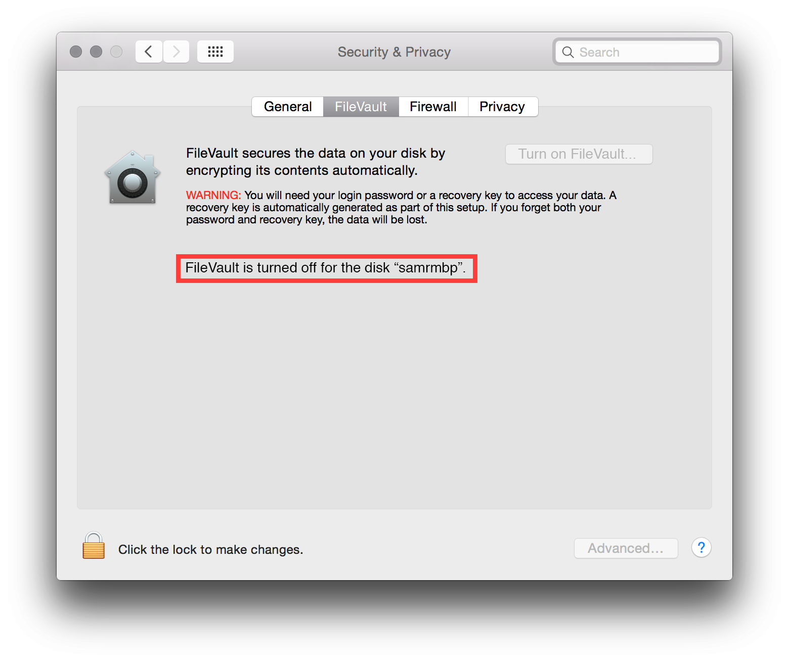
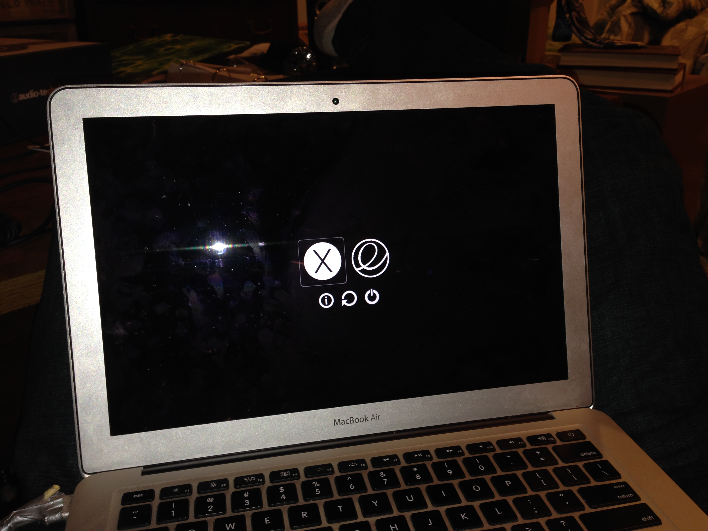

### elementary OS Isis on a Mac

**NOTE**: I'm making a few assumptions about the way your computer is set up. Namely:

#### Your ESP partition is located at disk0s1
(If it's not, make sure you use the proper location. It should be though.)

#### You don't have FileVault2/full disk encryption on
(Actually this *should* work with FDE on, but it's more complicated)

0. Back your shit up
1. Download rEFInd (http://www.rodsbooks.com/refind/getting.html)
2. Install rEFInd (`install.sh --esp`)
3. Mount your ESP partition (`mkdir /Volumes/ESP && sudo mount -t msdos /dev/disk0s1 /Volumes/ESP/`)
4. Rename the the refind folder (`mv /Volumes/ESP/EFI/refind/ /Volumes/ESP/EFI/BOOT`)
5. Rename the `.efi` file (I forget what it's called, but there should only be one) to `bootx64.efi`
6. Fire up Disk Utility and make a new partition/replace your old Linux install partition with a new partition formatted as FAT. Name it something catchy, like "ISIS" (it'll be overwritten in step #11)
7. Plug your USB drive with elementary OS Isis (If you need to make one, this is the best guide: http://www.maketecheasier.com/install-dual-boot-ubuntu-in-macbook-air/) into your computer.
8. Pray
9. Reboot and choose the option that indicates that the OS lives on an external/USB disk.
10. Go to the installer and when it asks about partitioning, make sure you use the **advanced configuration thing**. Find the partiton you created in step #7 and format that as Ext4 and set its mount point to `/`. **DO NOT** install GRUB. Make you set GRUB to install the USB drive. Obviously it's read-only and this will fail, but that's what you want. This setup is completely GRUB free, using EFI-stub loading (the new hotness).
11. Finish installing and restart.
12. Pray
13. Assuming all went well, you should see something two Ubuntu options in the rEFInd menu. Pick one, it doesn't matter.
14. You're now dual-booting Isis and OS X. Woot.
15. (optional) Make your rEFInd nicer. You can install a theme, get rid of the duplicate entries, etc. If you want to know how to do that stuff let me know and I'll document it. You can get your stuff looking this sexy:

